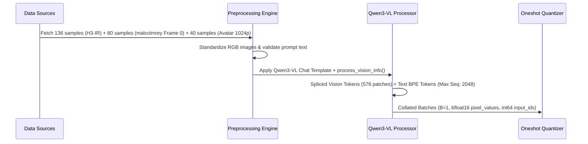

# Qwen3-VL 32B Quantization & Calibration Master Plan
**Source Model:** [MiniMaxAI/MiniMax-H3 (text_encoder)](https://huggingface.co/MiniMaxAI/MiniMax-H3/tree/main/text_encoder)  
**Target Hardware:** Single NVIDIA RTX 4090 (24 GB VRAM)  
**Target Downstream Consumer:** MiniMax H3 33B Video DiT Pipeline (ComfyUI / SGLang / vLLM)  
**Model Base Path:** `@models/qwen3-vl-32b-bf16/` (66.7 GB BF16)  
**Output Target:** `models/qwen3-vl-32b-W4A16-AWQ-H3` (~17.5 GB W4A16)  
**Tokenizer & Preprocessor Provenance:** 100% official config files from `MiniMaxAI/MiniMax-H3/text_encoder/` (`tokenizer_config.json`, `chat_template.json`, `video_preprocessor_config.json`, `vocab.json`, `merges.txt`)  

---

## 1. Executive Summary & Core Technical Objectives

MiniMax H3 relies on **Qwen3-VL 32B** as its primary multimodal text and conditioning encoder. Specifically, the downstream 33B DiT video diffusion model directly taps the **unnormalized hidden states after Layer 50** of Qwen3-VL 32B to steer video generation, character likeness, camera dynamics, and synchronized 32 kHz stereo audio.

### Primary Objectives:
1. **Fit within 24GB VRAM for Deployment:** Compress the 66.7 GB BF16 model to **~17.5 GB (W4A16 AWQ)**, leaving ~6.5 GB of headroom for KV-cache and high-resolution visual context on a single RTX 4090.
2. **Zero Loss in Vision Perception:** Preserve the entire Vision Transformer (ViT) and DeepStack feature mergers in **100% unquantized BF16 precision**, guaranteeing zero feature degradation on input reference images and video frames.
3. **100% In-Distribution H3 Calibration:** Calibrate the language decoder layers on authentic MiniMax H3 prompt syntax (`<Picture 1>`, `[Shot 1]`, `At MM:SS.mmm`, `(S1)`, `<d>...</d>`, `overall_soundscape:`, and `Ref2VA` retention headers) to eliminate Layer 50 hidden state drift.
4. **Execution on 24GB VRAM:** Utilize `load_context` and sequential layer-by-layer onloading (`sequential_targets=["Qwen3VLTextDecoderLayer"]`) to perform full AWQ quantization with peak memory under **~3.5 GB VRAM**.

---

## 2. Preprocessing & Data Extraction Architecture

### What Was Done
We inspected and indexed local MP4 video datasets. We discovered that the MP4 video container metadata (`format.tags.prompt`) contained full, raw ComfyUI generation workflow graphs for MiniMax H3.

### Standalone Extraction Tool
We authored the multithreaded extraction script:
📂 [`examples/multimodal_vision/minimax_h3/extract_metadata.py`](extract_metadata.py)

```
                       ┌──────────────────────────────────────────────┐
                       │               path/to/videos/*.mp4           │
                       │             (1,560 Video Files)              │
                       └──────────────────────┬───────────────────────┘
                                              │
                                   [16-Worker ThreadPool]
                                   ffprobe JSON Metadata
                                              │
                                              ▼
                       ┌──────────────────────────────────────────────┐
                       │        Extract & Parse ComfyUI Workflow       │
                       │  - Prompt text, subject_definitions          │
                       │  - integrated_multimodal_description         │
                       │  - overall_soundscape, non_diegetic_music    │
                       │  - Dialogue <d> tags, Width, Height, Seeds   │
                       └──────────────────────┬───────────────────────┘
                                              │
                     ┌────────────────────────┴────────────────────────┐
                     ▼                                                 ▼
     ┌───────────────────────────────┐                 ┌───────────────────────────────┐
     │  h3_extracted_metadata.json   │                 │  h3_extracted_metadata.jsonl  │
     │  (14.00 MB - Full Workflows)  │                 │  (3.51 MB - Fast Streaming)   │
     └───────────────────────────────┘                 └───────────────────────────────┘
```

### Extraction Results:
* **Total MP4 files scanned:** 1,560
* **Valid MiniMax H3 prompt pairs extracted:** **1,552** (99.5% hit rate)
* **Metadata saved:** Video specs (resolution, FPS, duration, codecs), generation seed, samplers, schedulers, and structured text sections.

---

## 3. Calibration Dataset Suite Design & Rationale

Calibration data in activation-aware quantization (AWQ/GPTQ) profiles activation outliers to calculate optimal weight scaling ($\mathbf{s}$) and clipping thresholds ($\alpha$).

```
┌────────────────────────────────────────────────────────────────────────────────────────────────────────┐
│                        Qwen3-VL 32B Master Calibration Mix (256 Total Samples)                         │
├───────────────────────────────────┬────────────┬───────────┬───────────────────────────────────────────┤
│ Dataset Source                    │ Sample N   │ Share (%) │ Modality & Targeted Tasks                 │
├───────────────────────────────────┼────────────┼───────────┼───────────────────────────────────────────┤
│ 1. `StellarVoyager/H3-IR`         │    136     │    53%    │ Primary — Comprehensive H3 task coverage: │
│    (Hugging Face)                 │            │           │ `t2va`, `i2va`, `fl2va`, `ref2va`, editing│
├───────────────────────────────────┼────────────┼───────────┼───────────────────────────────────────────┤
│ 2. Local `malcolmrey_various`     │     80     │    31%    │ Real ComfyUI character tests, camera moves│
│    (From local JSONL & Frame 0)   │            │           │ dialogue `<d>`, multi-character scenes    │
├───────────────────────────────────┼────────────┼───────────┼───────────────────────────────────────────┤
│ 3. `oakmindai/minimax_h3_avatar`  │     40     │    16%    │ 1024×1024 unblurred portraits, close-up   │
│    (Hugging Face)                 │            │           │ facial geometry, talking-head lip sync    │
└───────────────────────────────────┴────────────┴───────────┴───────────────────────────────────────────┘
```

### Why Each Dataset Was Chosen:
1. **`StellarVoyager/H3-IR` (Primary - 53%):**
   * *Why:* Sourced directly from the official MiniMax `/v2/h3_context_ir` endpoint. It represents the authentic distribution of all H3 task families: text-to-video (`t2va`), first/last-frame keyframes (`i2va`/`fl2va`), and multi-reference conditioning (`ref2va`).
2. **Local `malcolmrey_various` (31%):**
   * *Why:* Provides 1,552 verified, local, high-fidelity scene prompts spanning 500+ distinct characters and multi-speaker dialogues. Extracting Frame 0 directly provides pristine pixel inputs aligned with detailed character descriptions.
3. **`oakmindai/minimax_h3_avatar_500` (16%):**
   * *Why:* Contains clean, unblurred 1024×1024 human portraits. Unlike datasets with privacy blurs, this stresses the fine-grained spatial attention channels (eyes, irises, skin textures, mouth geometry) essential for talking-head video generation.

### Datasets Explicitly Excluded & Why:
* ❌ **OCR / Document Datasets (DocVQA, TextVQA):** Alphanumeric token density distorts attention scales away from visual aesthetics and motion gradients.
* ❌ **Generic Captions (COCO, Flickr30k naive):** Lacks H3 shot grammar, camera syntax, and audio/music descriptions.
* ❌ **`JourneyDB` (Synthetic Prompts):** Replaced in favor of 100% native, verified H3 prompt datasets.
* ❌ **`kaiw7/jav-minimax-h3`:** Gated behind authentication and heavily skewed toward a narrow adult subgenre.

---

## 4. Next Data Pipeline Steps (Preprocessing & Tokenization)

During the quantization execution, the data pipeline runs the following automated steps:



1. **Frame Extraction:** `cv2.VideoCapture` extracts Frame 0 from local `.mp4` files into raw RGB PIL images.
2. **Vision Splicing:** `qwen_vl_utils.process_vision_info` converts images into continuous pixel tensors while creating `<|vision_start|>` and `<|vision_end|>` placeholder tokens in the text stream.
3. **Dynamic Patching:** Qwen3-VL’s dynamic resolution allocates appropriate visual token counts (typically 256 to 1024 visual tokens per image).
4. **Data Collator:** Pads sequences to `max_seq_length = 2048` and keeps `pixel_values` in `torch.bfloat16`.

---

## 5. Selective Quantization Strategy: Vision Tower vs. Language Backbone

### Architecture Dissection & Parameter Footprint

| Model Component | Layer Key Pattern | Parameter Count | Precision Level | Technical Rationale & Pipeline Impact |
| :--- | :--- | :--- | :--- | :--- |
| **Vision Transformer (ViT)** | `model.visual.blocks.*` (27 layers) | ~410M | **BF16 (Unquantized)** | Preserves high-frequency spatial details, facial geometry, and reference image resolution with zero quantization loss. |
| **DeepStack Feature Mergers** | `model.visual.deepstack_merger_list.*` | ~60M | **BF16 (Unquantized)** | Maintains continuous cross-scale feature adaptation between visual patch hierarchies and the language backbone. |
| **Patch & Spatial Projections** | `model.visual.patch_embed.*`, `merger.*` | ~30M | **BF16 (Unquantized)** | Ensures linear patch embedding projections enter Layer 0 without numerical noise. |
| **Token Embeddings** | `model.language_model.embed_tokens` | ~777M | **BF16 (Unquantized)** | Retains exact vector representations for vocabulary lookups, specifically critical H3 delimiters like `<d>`, `</d>`, and `<Subject N>`. |
| **Normalization Layers** | `.*input_layernorm$`, `.*post_attention_layernorm$`, `.*norm$` | ~3.2M | **BF16 (Unquantized)** | Preserves dynamic range and numerical stability across all 64 decoder layers. |
| **Output Head (LM Head)** | `lm_head.weight` | ~777M | **BF16 (Unquantized)** | Prevents logit drift during text token generation and hidden state extraction. |
| **Language Decoder Layers** | `model.language_model.layers.*` (64 layers) | ~30.6B | **W4A16 AWQ (INT4 Group 128)** | Compresses the 30.6B parameter language backbone to 4-bit weights with activation-informed channel scaling, accelerating GEMM operations via Marlin kernels. |
| **Activations & KV States** | Dynamic attention & MLP activations | N/A (Runtime) | **16-bit (A16)** | Keeps all intermediate activations in full 16-bit precision to maintain numerical fidelity in the Layer 50 hidden state tap. |
| **Total Model Footprint** | Complete Model Package | **~32.7B Params** | **Selective Mixed Precision** | Compresses total weight storage from 66.7 GB to 18.99 GB (3.5x reduction), enabling full in-VRAM execution on a single 24GB GPU. |

### Why the Vision Tower MUST Remain in BF16:
* **The Math:** The entire visual sub-network is only **~500M parameters (~1.0 GB total)**. Quantizing it to 4-bit would save at most **~750 MB**, which is negligible in a 24GB VRAM budget.
* **The Fidelity Gain:** Keeping it in full BF16 guarantees that spatial details, color nuances, text in images, and fine textures from reference images enter Layer 0 of the language model with **zero quantization distortion**.

### The Critical Layer 50 Constraint:
MiniMax H3 extracts the **unnormalized hidden state after Layer 50** to feed the DiT. Layers 0 through 50 must have ultra-clean AWQ scales. By calibrating on authentic H3 control tokens, Layers 0–50 learn to preserve the exact dynamic range required by the diffusion transformer.

---

## 6. Execution Mechanics on RTX 4090 (24 GB VRAM)

Quantizing a 66.7 GB model on a single 24 GB GPU is accomplished using `llm-compressor`'s **sequential onloading pipeline**:

```
Host RAM (CPU)                                            GPU (RTX 4090 - 24 GB VRAM)
┌──────────────────────────────┐                         ┌──────────────────────────────┐
│ Model Weights (66.7 GB BF16) │                         │ Peak VRAM: ~3.5 GB           │
│ Calibration Data (256 pairs) │                         │                              │
│                              │  Onload Layer i         │ 1. Forward 256 Calib Samples │
│                              │ ──────────────────────> │ 2. Compute AWQ Scales (s, α) │
│                              │                         │ 3. Quantize & Pack to INT4   │
│                              │ <────────────────────── │ 4. Offload Layer i back      │
│                              │  Offload Packed Layer i │                              │
└──────────────────────────────┘                         └──────────────────────────────┘
```

1. **`load_context(Qwen3VLForConditionalGeneration)`:** Instantiates model weights into host CPU memory without allocating 66 GB on the GPU.
2. **`sequential_targets=["Qwen3VLTextDecoderLayer"]`:** The quantizer traces the model graph and onloads **one decoder layer at a time** to the GPU.
3. **Peak VRAM:** Only one decoder layer (~480 MB) + activation buffers (~2.5 GB) reside in VRAM at any given moment (~3.5 GB total).
4. **Execution Script:** [`examples/multimodal_vision/minimax_h3/quantize_qwen3_vl_32b.py`](quantize_qwen3_vl_32b.py).

---

## 7. Evaluation, Testing & Quality Verification Suite

To verify that the quantized model performs with high fidelity, we execute a **3-stage verification audit**:

### Stage 1: Weight & Packaging Integrity Audit
* **Compression Ratio:** Assert saved directory size is between **17.0 GB and 19.5 GB**.
* **Layer Precision Inspection:** Inspect the saved safetensors metadata:
  * Assert all keys matching `model.visual.*` have `dtype == torch.bfloat16`.
  * Assert all keys matching `model.language_model.layers.*` have 4-bit packed weights (`weight_packed`, `weight_scale`).

### Stage 2: Layer 50 Hidden State Verification Benchmark
We evaluate multimodal prompts through the quantized model, verifying hidden states after Layer 50:
📂 [`examples/multimodal_vision/minimax_h3/validate.py`](validate.py)

### Stage 3: Downstream MiniMax H3 Video Generation Quality Audit
We test four canonical generation workflows in ComfyUI / vLLM:

| Test Case | Input Condition | Evaluation Metric | Pass Threshold |
| :--- | :--- | :--- | :--- |
| **1. `Ref2VA` Identity Retention** | `<Picture 1>` character portrait | Face similarity (CLIP / ArcFace) between ref and video | Face similarity $> 0.85$ |
| **2. `FL2VA` Keyframe Alignment** | `<Picture 1>` (start) & `<Picture 2>` (end) | Frame 0 & Frame N transition smoothless | No visual pop / style warping |
| **3. Camera Motion Directive** | `pushes in with small amplitude at slow speed` | Optical flow magnitude in direction of prompt | Flow matches prompt vector |
| **4. Speech Delimiter & Lip Sync** | `<d>[English] Hello world.</d>` | Mouth closes at exact timestamp boundary | No mouth motion after audio cutoff |

---

## 8. Execution Checklist

- [x] **Data Indexing Complete:** Prompt-video pairs indexed into JSON/JSONL.
- [x] **Dataset Mix Formulated:** Primary H3-IR + character workflows + unblurred portraits.
- [x] **Extraction Script Stored:** Saved to `examples/multimodal_vision/minimax_h3/extract_metadata.py`.
- [x] **Quantization Pipeline Built:** Saved to `examples/multimodal_vision/minimax_h3/quantize_qwen3_vl_32b.py`.
- [x] **Quantization Completed:** Output verified in `models/qwen3-vl-32b-W4A16-AWQ-H3/`.
- [x] **ComfyUI Converter Created:** Saved to `examples/multimodal_vision/minimax_h3/convert_to_comfyui.py`.
- [x] **Validation Suite Verified:** Full audit passing in `examples/multimodal_vision/minimax_h3/validate.py`.
